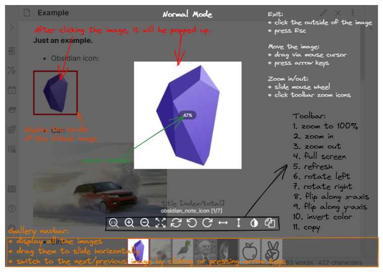

# Awesome Image

A one-stop solution for image management together
with [Obsidian Image Toolkit](https://github.com/sissilab/obsidian-image-toolkit)'s marvelous image view experience.

## Design philosophy

- **Always available**. No internet? No problem. Your images live completely offline, internet or service issues will
  never be your problem.
- **Center management**. Images no more scatter around, which leads to outdated links and useless files.
- **Just enough automation**. Auto process pasted image, but let you know all that happened.

## Features

- Zoom in or out an image by mouse wheel or clicking toolbar zoom icons
- Move an image by dragging mouse cursor or pressing keyboard arrow keys
- Preview an image in full-screen mode
- Rotate or flip an image by clicking footer toolbar icons
- Invert the color of an image
- Copy an image
- 💾 Command to copy images to a user-defined folder with a uniform name, and update links in your notes.
- Export a note or folder with its referenced local images while preserving vault-relative paths and leaving originals unchanged.
- 🔗 Auto download internet images.
- ⚡ Auto process image the second you paste it, whether it's from internet or is binary format.
- 🔎 Command to list all images that are not linked by your notes, which can be deleted manually.

## Normal Mode

When you turn off 'Pin an image' on the settings page, it's in **Normal Mode**.



**Rule**:
- After clicking the image, the image will be popped up with transparent mask layer on the background
- You can only click and preview one image at a time
- You cannot edit and look through your notes, or other operations except to view and operate the image in the Normal Mode

**Gallery Navbar**:
- All the images in the current note will be displayed at the bottom, and you can switch these thumbs to view any image
- To be able to use this functionality, you need to turn on 'display gallery navbar' on the plugin settings page
- The background color of the gallery navbar and the border color the selected image can be set on the plugin settings page

**Exit**:
- Click the outside of the image
- Press Esc
> If it's in full-screen mode, you need to exit full-screen mode firstly, then exit the image preview page and close popup layer.

## Image processing

**IMPORTANT NOTE** Since the plugin can modify your notes, please back up your vault for the first time, to ensure the
plugin is acting the way you want.

The best way to use this plugin is toggle on `On paste processing` in settings and then
run `Awesome Image: Process images for all your notes` once.
After that, all your images will be in good hands.

You may also want to toggle *OFF* `Use [[Wikilinks]]` under `Files & Links` since only Markdown links is supported now.

Below are all commands it offers:

1. Press `Ctrl+P` (or `Cmd+P` on macOS) to open the Command palette.
2. Type the name (or partial name) of the command you want to run.
3. Navigate to the command using the arrow keys.
4. Press Enter.

The command names are:

1. `Awesome Image: Process images for active file`
2. `Awesome Image: Process images for all your notes`
3. `Awesome Image: List images that are not linked by your notes`

Enable `Show export menu` in the plugin settings to right-click a Markdown file or folder in the File Explorer and
choose `Export notes with referenced images`. The option is hidden by default. Enter a vault-relative destination
folder when prompted. The plugin recursively copies the selected notes and their referenced local images while
preserving each file's original vault path, so the links in the copied notes continue to work without any rewriting.
Existing destination files are not overwritten.

To see results of `List images that are not linked by your notes`, you may want to open Developer Tools by pressing
Ctrl+Shift+I in Windows and Linux, or Cmd-Option-I on macOS.

## Development

Development requires Node.js 22 or newer. Install dependencies, run the checks and build the plugin, then deploy the
generated files directly to a local vault:

```shell
npm install
npm test
npm run build
npm run deploy -- "C:/path/to/your/vault"
```

The vault path can also be provided through the `OBSIDIAN_VAULT` environment variable. The deploy command installs
`main.js`, `manifest.json`, and `styles.css` under `.obsidian/plugins/awesome-image/`. Enable **Awesome Image** in
Obsidian's community plugins after the first deployment. Restart Obsidian after changing `manifest.json`; for source
changes, rebuild and reload the plugin.

## Release

Use npm's version command to update `package.json`, `package-lock.json`,
`manifest.json`, and `versions.json`, then push the generated commit and tag
(tags intentionally have no `v` prefix):

```bash
npm version patch
git push origin master --follow-tags
```

The release branch for this repository is `master`.

Pushing the tag starts the release workflow. It checks the version, builds the
plugin, and creates a draft GitHub release containing `main.js`,
`manifest.json`, and `styles.css` for review and publication.

## How it works

When Process images:

1. Locate the image using regex in notes.
2. Get image from binary data or from internet(if it is an url), calc the SHA256 hash of the image.
3. Copy image file to user-defined folder, image file name is derived from SHA256 to avoid conflict.
4. Change the image path in note to direct to the new image file.
5. The old image will NOT be deleted for data security reasons, you can find them using the command below.

When List images:
Compare image files and links in your notes, and display images that are not linked by your notes in Developer Tools
console.

When Paste image:
Acts just like Process images for pasted content but automated (ensure `On paste processing` is toggled on in settings).

## Attribution

Special thanks to sissilab's marvelous [Obsidian Image Toolkit](https://github.com/sissilab/obsidian-image-toolkit),
the plugin is based on this great work.
